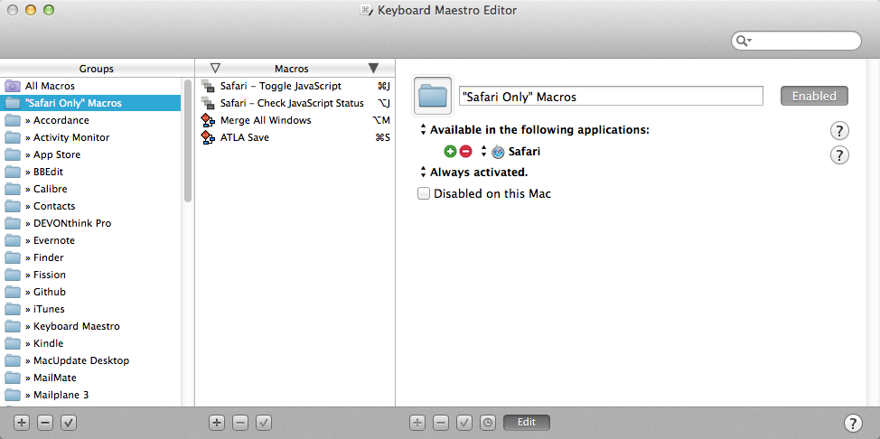
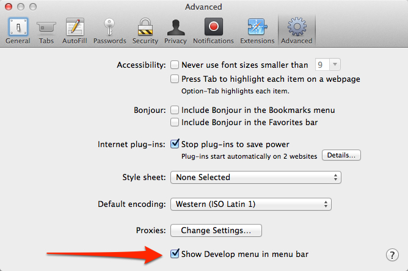

km-toggle-javascript
====================

Two Keyboard Maestro macros:

### [Safari-Check-JavaScript-Status.kmmacros](https://raw.github.com/tjluoma/km-toggle-javascript/master/Safari-Check-JavaScript-Status.kmmacros)

Press <kbd>⌥</kbd> + <kbd>J</kbd> and OS X will show a notification window informing you whether JavaScript in Safari is enabled or disabled.

### [Safari-Toggle-JavaScript.kmmacros](https://raw.github.com/tjluoma/km-toggle-javascript/master/Safari-Toggle-JavaScript.kmmacros)

Press <kbd>⌘</kbd> + <kbd>J</kbd> and Keyboard Maestro will enable or disable JavaScript in Safari, toggling its status compared to what it was.

If there is a current page in Safari, it will be reloaded.

### Downloading and installing Keyboard Maestro macros

1.	Right-click (or control-click) the `.kmmacros` files and save them, ***or*** [download a zip file](https://github.com/tjluoma/km-toggle-javascript/archive/master.zip) with both of them.

2.	Note that if you download the `.kmmacros` files, your browser may add a “.txt” to the filename, but Keyboard Maestro needs the extension to be “.kmmacros”.

3.	Import them into Keyboard Maestro by double-clicking on them, or by launching **Keyboard Maestro.app** and choosing **File » Import Macros…** from the menu bar.

### “For Safari Only”

Since these macros are intended only to be used in Safari, they will be placed into a new “Group” in Keyboard Maestro called **“Safari Only” Macros** as shown here:

As you can see, the “Group” in Keyboard Maestro has been designated to only be available in Safari.

(The other two macros “Merge All Windows” and “ATLA Save” are other macros I have made, but are not included here.)

### Requirements

Both of these macros require that Safari has “Show Develop menu in menu bar” is checked, as shown:

